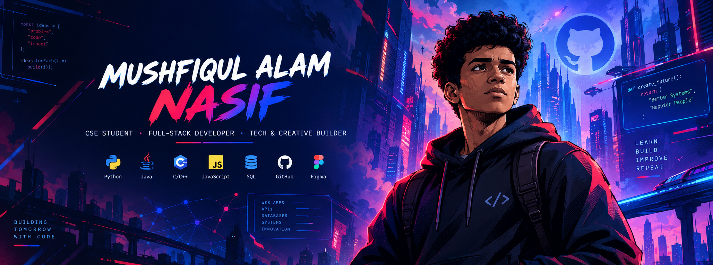

<!-- 3D CYBER ARCADE BANNER -->

  

<!-- 3D WAVING GLOW -->

  

<!-- CONTROLLER QUICK-LAUNCH HUD -->

  
  
  
  

---

## 🕹️ CHARACTER STATUS // PLAYER 1 HUD

| HUD Attribute | System Metric & Diagnostics |
| :--- | :--- |
| **Hero Tag** | **Mushfiqul Alam Nasif** |
| **Character Class** | **Full-Stack Engineer & Interactive Graphics Builder** |
| **Academy Guild** | **BAUST, Khulna** — B.Sc. in Computer Science & Engineering (3rd Year, 2nd Sem) |
| **Guild Roles** | **President** @ BAUST Cultural & Debate Club • **Founder** @ Innovation & Career Hub[cite: 4] |
| **Special Trait** | Physics Collision Loops • Human-Centered Architecture • Multi-Disciplinary Educator[cite: 4] |
| **Server Status** | 🟢 Ready for High-Scale Production Sprints |

---

## 🎮 CORE LEVEL PROGRESSION // ACADEMIC STATS

| Tier / Campaign | Training Ground | Score / Grade | Timeline |
| :--- | :--- | :---: | :---: |
| **B.Sc. in Computer Science & Engineering** | Bangladesh Army University of Science & Technology (BAUST), Khulna[cite: 4] | **Level 3 (2nd Sem)**[cite: 4] | 2024 – Present[cite: 4] |
| **Higher Secondary Certificate (HSC)** | Abdul Kadir Mollah City College (AKMCC), Dhaka Board[cite: 4] | **MAX 5.00 / 5.00**[cite: 4] | 2020 – 2022[cite: 4] |
| **Secondary School Certificate (SSC)** | Brahmondi K.K.M. Govt. High School, Narsingdi, Dhaka Board[cite: 4] | **MAX 5.00 / 5.00**[cite: 4] | 2020[cite: 4] |

> **Core Skill Trees Unlocked:** Data Structures & Algorithms, Database Systems (DBMS), Software Engineering, Computer Networks[cite: 4].

---

## 🏆 TROPHY ROOM & QUEST HONORS

| Quest / Tournament | Arena / Guild | Honor Earned |
| :--- | :--- | :---: |
| **Tech Trex Tournament** | IUT Automech | 🏅 **Top 10 Finalist**[cite: 4] |
| **AI & Blockchain Olympiad Bangladesh** | National Olympiad Syndicate | 🏅 **Top 25 Finalist**[cite: 4] |
| **National English Olympiad** | National Circuit | 🥇 **Rank #1 / Champion**[cite: 4] |
| **KUET Cennovation Arena** | Khulna University of Engineering & Technology | 🎯 **Prize Winner**[cite: 4] |
| **UIHP Programme** | Institutional Competitive Track | 🎯 **Prize Winner**[cite: 4] |
| **National Debate Tournament** | National Forensics League | 🎙️ **Official Competitor**[cite: 4] |

---

## ⚔️ HERO MISSIONS & GUILD EXPEDITIONS

<b>🔹 Main Quest: Software Engineering Internship</b>

 

* **Guild:** `fly8` *(2025 – 2026)*[cite: 4]
* **Role:** **Software Development Intern**[cite: 4]
* **Combat Record:**
  * Shipped core software deliverables and maintained end-to-end task pipelines[cite: 4].
  * Collaborated inside agile development cycles, code reviews, and Git-driven version control workflows[cite: 4].

<b>🔹 Community Guilds & Leadership Tracks</b>

 

* **President** | `BAUST Khulna Cultural & Debate Club` — Orchestrating campus-wide forensics, tournaments, and public speaking mastery[cite: 4].
* **Founder & Owner** | `Innovation & Career Hub` — Designing career acceleration roadmaps and student tech empowerment[cite: 4].
* **Founder & Owner** | `Euphoria Sports` — Directing brand execution, community tournaments, and sports operations[cite: 4].
* **Campus Ambassador** | `10 Minute School` • `ACS` • `Sputnik Astronomical Society` • `NOHA` *(2020 – 2022)*[cite: 4]

<b>🔹 Mentorship Mastery & Knowledge Guild</b>

 

* **Offline Teacher (Classes 6–12)** | `Private Tutoring, Khulna & Narsingdi` *(2021 – 2026)*[cite: 4]
  * Mentored students across foundational STEM disciplines, building deep conceptual clarity and structured exam systems[cite: 4].

---

## 🕹️ FEATURED MINI-GAME: 2D TABLE TENNIS ENGINE

  
  

| Arena Menu | Match Screen |
| :---: | :---: |
|  |  |

* **Engine Attributes:** HTML5 Canvas rendering loop, custom bounce physics, steering deflection angles, adaptive CPU difficulty, local 2-player mode, and Web Audio API integration.

---

## 🛠️ CHARACTER SKILL TREE & ARSENAL

### Core Spells (Programming Languages)

  

### Cloud, Storage & Production Engines

  

### Creative & Analytic Gear

  

  <code>Power BI</code> • <code>Google Workspace (G-Suite)</code> • <code>Microsoft Office Suite</code>[cite: 4]

---

## 🌐 MULTIVERSE COMM SPECS & INTERESTS

* **Language Passports:**
  * 🇧🇩 **Bengali:** Native Mother Tongue[cite: 4]
  * 🇬🇧 **English (CEFR C1 — Proficient):** Fluent in technical, debate, and international documentation[cite: 4]
  * 🇸🇦 **Arabic (CEFR B1 — Independent):** Conversational & reading proficiency[cite: 4]
* **Guild Memberships:** Bangladesh Scouts[cite: 4]
* **Passive Attributes:** Football, Music, Travelling, Poem Writing, Debate[cite: 4]

---

<!-- 3D DYNAMIC SHIFTING FOOTER WAVE -->

  

