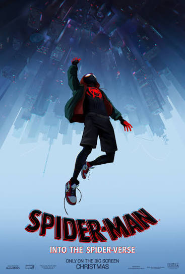
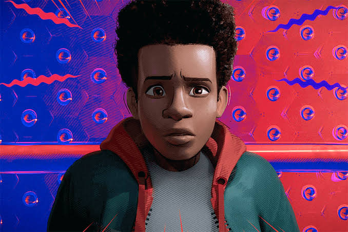

<!-- 1. 3D DYNAMIC SHIFTING CYLINDER HEADER -->

  

  <!-- GLITCH TYPING ANIMATION -->
  

   

  <!-- NEON SOCIAL LAUNCHERS -->
  
  
  
  

---

### 🕷️ ABOUT ME // MISSION DOSSIER

<table width="100%" style="border-collapse: separate; border-spacing: 10px;">
  <tr>
    <td width="35%" align="center" valign="middle">
      
    </td>
    <td width="65%" valign="top">
      <h2>⚡ "It's a leap of faith. That's all it is, Miles."</h2>
      

        I am a <b>Computer Science & Engineering undergraduate at BAUST</b>, driven by human-centric development, interactive graphics engines, and competitive problem-solving. Whether engineering responsive client-side physics or structuring resilient web backends, I thrive at the crossroads of precision engineering and creative storytelling.
      

      

      <h3>⚡ Core Operational Profiles:</h3>
      <ul>
        <li><b>Software Development:</b> Proven track record with hands-on development in Python, Java, C/C++, and full-stack web architectures.</li>
        <li><b>Startup & Product Engineering:</b> Former Software Intern at <b>fly8</b>, managing end-to-end sprint deliverables, agile pipelines, and version-controlled environments.</li>
        <li><b>Entrepreneurship & Campus Leadership:</b> President of <b>BAUST Khulna Cultural & Debate Club</b>, Founder of <b>Innovation & Career Hub</b>, and Founder of <b>Euphoria Sports</b>.</li>
        <li><b>STEM Mentorship:</b> 5+ years of teaching experience across Class 6–12, mentoring students in conceptual clarity, mathematics, and exam methodology.</li>
      </ul>
    </td>
  </tr>
</table>

---

### 🎬 MULTIVERSE CINEMA // THE SPIDER-MAN ARCHIVES

<table width="100%">
  <tr>
    <td width="50%" align="center">
      
    </td>
    <td width="50%" valign="middle">
      <table width="100%">
        <tr>
          <th>Archive</th>
          <th>Rating / Portal</th>
          <th>Iconic Protocol</th>
        </tr>
        <tr>
          <td><b>🕷️ Spider-Man (2002)</b></td>
          <td></td>
          <td><i>"With great power comes great responsibility."</i></td>
        </tr>
        <tr>
          <td><b>🚆 Spider-Man 2 (2004)</b></td>
          <td></td>
          <td><i>"Sometimes to do what's right, we have to give up the thing we want the most."</i></td>
        </tr>
        <tr>
          <td><b>🖤 Spider-Man 3 (2007)</b></td>
          <td></td>
          <td><i>"Whatever comes our way, the choice is always ours."</i></td>
        </tr>
        <tr>
          <td><b>🌌 Into the Spider-Verse</b></td>
          <td></td>
          <td><i>"When will I know I'm ready? You won't. It's a leap of faith."</i></td>
        </tr>
      </table>
    </td>
  </tr>
</table>

---

### 🕹️ FEATURED PROJECT: 2D TABLE TENNIS ENGINE

<table width="100%">
  <tr>
    <td width="50%" align="center">
      
    </td>
    <td width="50%" align="center">
      
    </td>
  </tr>
  <tr>
    <td colspan="2" align="center">
      <b>🏓 Arcade Canvas Web Game:</b> Real-time collision physics, steering deflection angles, selectable CPU AI tiers, 2-player local multiplayer, and Web Audio API integration. 
      <a href="https://table-tennis-game-psi.vercel.app/"><b>🚀 [LAUNCH LIVE ON VERCEL]</b></a> &nbsp;|&nbsp; <a href="https://github.com/nasif120696-collab/table-tennis-game-"><b>📂 [INSPECT REPOSITORY CODE]</b></a>
    </td>
  </tr>
</table>

---

### 🏆 COMPETITIVE WINS & HONORS

<table>
  <tr>
    <th width="33%">🎖️ Engineering & Hackathons</th>
    <th width="33%">🎙️ Forensics & Leadership</th>
    <th width="33%">🎓 Academic Foundations</th>
  </tr>
  <tr>
    <td valign="top">
      • <b>Top 10 Finalist</b> — Tech Trex (IUT Automech) 
      • <b>Top 25 Finalist</b> — AI & Blockchain Olympiad Bangladesh 
      • <b>Prize Winner</b> — KUET Cennovation 
      • <b>Prize Winner</b> — UIHP Programme
    </td>
    <td valign="top">
      • <b>President</b> — BAUST Khulna Cultural & Debate Club 
      • <b>Founder</b> — Innovation & Career Hub 
      • <b>Founder & Owner</b> — Euphoria Sports 
      • <b>Participant</b> — National Debate Circuit 
      • <b>Campus Ambassador</b> — 10 Minute School, ACS
    </td>
    <td valign="top">
      • <b>B.Sc. in CSE</b> — BAUST, Khulna (3rd Year, 2nd Sem) 
      • <b>1st Place</b> — English Olympiad 
      • <b>HSC (Science)</b> — GPA 5.00/5.00 (AKMCC) 
      • <b>SSC (Science)</b> — GPA 5.00/5.00 (Brahmondi KKM) 
      • <b>Member</b> — Bangladesh Scouts
    </td>
  </tr>
</table>

---

### 🛠️ ARSENAL & SKILLS

  
<b>Languages</b>

  
    
  
<b>Frameworks, Cloud & Database</b>

  
    
  
<b>Design & Analytics</b>

   
  <code>Power BI</code> • <code>Google Workspace</code> • <code>Microsoft Office</code>

---

### 📊 3D TELEMETRY & MULTIVERSE STATS

  

 

  
  

 

  

 

<!-- 3D DYNAMIC FOOTER -->

  

